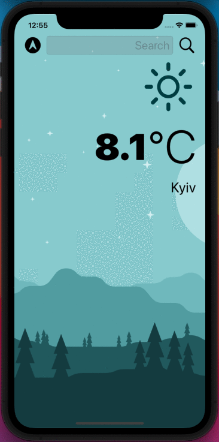

#  Clima

## This is Swift application, created by me in process of learning iOS Development, in particular, about dark-mode, delegate patterns, Swift protocols and extensions, Swift computed properties and closures with completion handlers.

### Clima is a dark-mode enabled weather app. You can check the weather for the current location based on the GPS data from the iPhone as well as by searching for a city manually. 

>This is a companion project to The App Brewery's Complete App Development Bootcamp, check out the full course at [www.appbrewery.co](https://www.appbrewery.co/)

